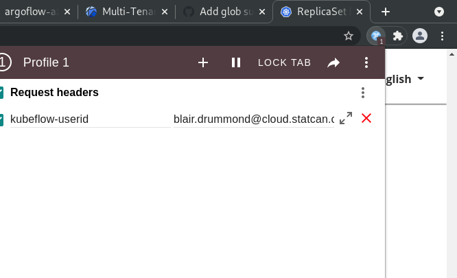

# Secrets generation & management

This is a helper for creating and managing secrets. It supports:

- Kubernetes Secrets
- Sealed Secrets
- Vault Secrets (argocd vault plugin)

## Requirements

```sh
kubectl
jq
make
stow
kubeseal # if used
python3
pip3 install -r requirements.txt
```

# How it works

The python script will read all `ARGOFLOW_` variables from your environment as defaults,
then it will define a bunch of tools (Dex, Keycloak, Grafana, etc) using the secrets it needs,
and it will use your requested secrets backed (kubernetes secrets, sealed secrets, vault secrets, etc).

That's it! Give it a try, with, for instance,

```bash
# This is it!
./argoflow.py -f --env-file examples/kind.env
pushd secrets
# If you want to use vault instead, change this command
# If you're deploying to a real cluster, don't use generated secrets
# unless using a private repo. Either use vault or sealed secrets.
./argoflow_secrets.py --oauth-type keycloak generated --env-file vault.env
popd
# This unpacks the secrets into the distribution via symlinks
make secrets/generated
``` 

Then, if you are just deploying to `kind`, then run

```
make deploy
```

- At the end, you should see an IP address for Argo. Run `make argo-get-pass` to get the login credentials, and go to that IP address in the browser to get into ArgoCD.

- Once in ArgoCD, you may need to do a hard-refresh on the kubeflow app (the little triangle on the "Refresh" button is hard refresh).

- Then, watch as Kubeflow comes up! You may need to click "Sync" on the apps more than once for everything to turn green. Be patient! :-)

- Once **Istio** and **Istio Resources** turn green in ArgoCD, run `make get-etc-hosts` to get Istio's new IP address. Add an entry to your `/etc/hosts` file with `<the ip> kubeflow.aaw.cloud.statcan.ca`.

You should be able to log into kubeflow once everything in ArgoCD is green!

## Debugging

### Issues with appications not in sync or unhealthy

This happens quite often, especiallya after the `make deploy`. Some applications need to be finished before others mnmay start. Some also need a little boost. It might be done by clicking on the application, Then the little triangkle -> `Hard Refresh` and finally `Sync`.

- check istio -> hard refresh -> synchrone
- check istio-resources
- central-dashboard
-> if no mimages `make custom-images`
- jupyter-web-app
- check all the controllers - notebook - prob etc
- profile contoller
- profiles
- pipelines
- certificates : especially if you cannot access the `kubeflow.aaw.cloud.statcan.ca`

### Error: Connection Refused

This happens if the services aren't ready yet. Make sure that the services in ArgoCD are green. (Especially Istio, Central Dashboard, and the Profile controller)

### Special note for WSL

The external IPs MetalLB creates *do not* work on WSL. Instead you will need to port-forward the services directly to a localhost address,
then use `netsh` to map an ip address to the port `127.0.0.1:<port number>`. See [this stack overflow post](https://stackoverflow.com/a/18786061)

## RBAC: Access Denied

If you get RBAC Access Denied, then try removing the authorization policies in the istio resources kustomization, like below

```yaml
# distribution/istio-resources/kustomization.yaml
apiVersion: kustomize.config.k8s.io/v1beta1
kind: Kustomization

resources:
# - deny-all-authorizationpolicy.yaml
- envoy-filter-kubeflow-userid.yaml
# - gateway-authorizationpolicy.yaml
- kubeflow-cluster-roles.yaml
- kubeflow-gateway.yaml
# - monitoring/
```

Once those are removed, run `make gitserver` and then do a hard-refresh on `Istio Resources` in ArgoCD.

## Tip: Setting or changing profiles

Install the [ModHeader](https://chrome.google.com/webstore/detail/modheader/idgpnmonknjnojddfkpgkljpfnnfcklj) Chromium extension, and then set `kubeflow-userid` to some email address; like below



You can use this to test registration flows or impersonate other users.
